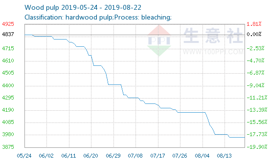

# Exame-Suzano-digitalHub-2021
Meu trabalho de DS para Hub Digital

# Case Predictive Maintenance: Paper CO 

The following is a fictional case study designed to loosely resemble the work you might undertake on a project. It will test your ability to handle big data and perform statistical/machine learning analyses as well as your ability to communicate your findings and derive commercial insight from your technical work. You may perform the analyses using any computational language you wish (including at least one tool different from excel). Please submit your code along with your presentation and the requested results file by the date agreed with the recruiting team.

## Scenario:
Paper CO is an important player that produces mainly cellulose providing this important material for the paper makers and for their own paper machines. The market is becoming more and more challenging due to international prices downfall of cellulose, see Figure 1.

Figure 1 – Wood pulp price in China in RMB 

( __source__ : http://www.sunsirs.com/uk/prodetail-958.html)

Due the challenging scenario, Paper Co is starting a project to reduce costs in maintenance avoiding over maintain some specific assets and keeping the same availability of all the process. To perform that, it will be necessary to predict failures in the selected assets. 
The head of the operations has asked whether it is possible to predict such events and based on your answers he will change the maintenance plans. 

## Your mission:

We have scheduled a meeting in one-week time with the head of operations in which you will present your findings and provide recommendations about changing the maintenance plans. As far as you know the **maintenance plan are done with fixed frequency by calendar time**.
The first phase is to check the viability of a **RUL (remaining useful life)** or/and a model to predict the failure with **at least 20 cycles ahead**. For training your model you will receive a dataset with information of 100 events of failures on these assets. See Table 1 with the information available. In the meeting is also necessary to demonstrate your understanding of the problem and show some statistics of the assets to illustrate the problem and the proposed solution.
Using the trained model, you should **score for each asset id on the test data providing the information if the asset will failure after more 20 cycles (probability 0-1) or (preferably) how many cycles left the asset still has (RUL)**. You will submit the test file output which have to contain a single column and one line for each test sample (100) providing the information above.
Your prediction will be scored using quality KPIs for machine learning algorithms, be prepared to comment the KPIs during the interview. You can simulate scenarios to demonstrate how the model perform against a naive process of changing the asset in a fixed period.
Finally, you will have to answer how the maintenance team will use your model to reduce costs. 

Table 1: Dataset with information of failures for each asset id.

| Field name  |	Description |
|-------------|-------------|
| Asset id |	Asset code. The code represents a complete run of the asset until its failure. After its failure it is replace by another asset with id + 1 code |
| runtime |	A measure of time that resets after failure |
| Setting1	| Set point 1 |
| Setting2	| Set point 2 |
| Setting3  | Set point 3 |
|Tag1 |	Sensor 1 |
|Tag2 |	Sensor 2 |
| … | … |
|Tag21 | Sensor 3 |

# Resolução

Para acessar o Notebook qclique aqui: [Notebook](./Desafio-HubDigital.ipynb)
